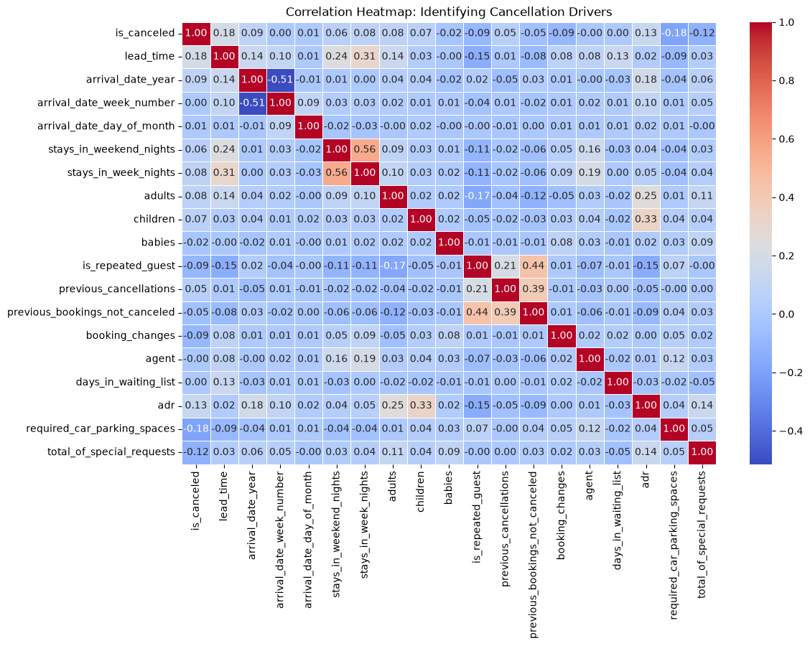
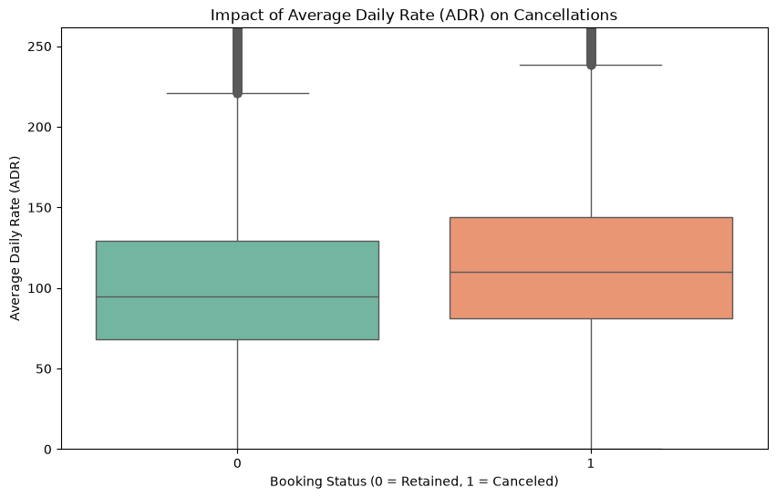
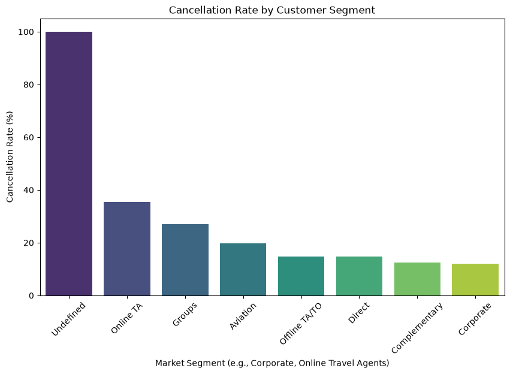

# Project: Travel, Tourism & Hospitality - Customer Retention and Dynamic Pricing Analysis

## Executive Summary
[cite_start]This project addresses revenue leakage in the hospitality sector caused by unoptimized pricing and unpredictable customer cancellations[cite: 67]. [cite_start]Our goal is to leverage historical booking datasets to identify key drivers of churn and provide actionable insights for a dynamic pricing engine[cite: 73, 74].

## Methodology
[cite_start]The project follows a structured 4-week engineering roadmap[cite: 43]:
* [cite_start]**Week 1: Data Acquisition & Cleaning:** Handled missing values (agent, country, children), removed duplicates, and engineered new time-series features (e.g., arrival date full)[cite: 97, 100].
* [cite_start]**Week 2: EDA & Statistical Testing:** Utilized correlation matrices and bivariate analysis to identify the relationship between ADR, lead time, and cancellation rates[cite: 101, 102].

## Key Findings (EDA)

* **Correlation Drivers:** Heatmap analysis identified key churn predictors and their relationships.

* **Price Sensitivity:** High Average Daily Rates (ADR) correlate positively with increased cancellation rates.

* **Channel Volatility:** The Online Travel Agent (OTA) segment exhibits the highest cancellation risk, while Corporate bookings remain the most stable.

## How to Reproduce
1. Clone the repository.
2. Ensure you have the `requirements.txt` installed.
3. Run the notebooks in order: `1_EDA_and_Cleaning.ipynb` followed by `2_EDA_and_Statistical_Testing.ipynb`.